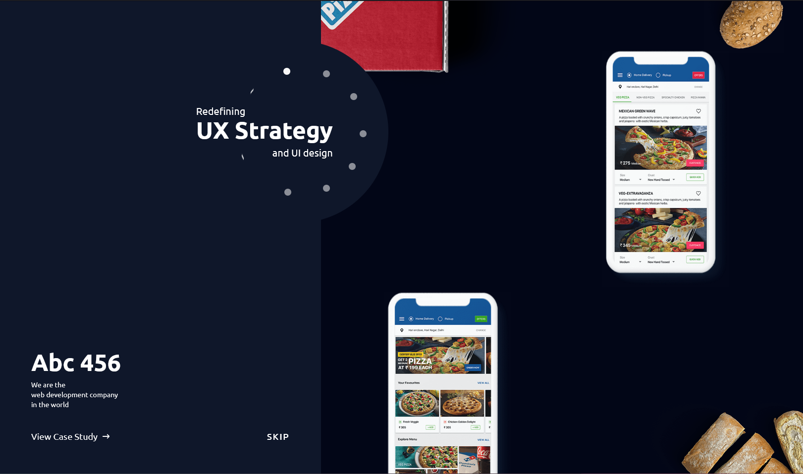

# ATG React.JS Development task 02

<h3 align="left">🛠 Technologies & Tools used:</h3>

<h3 align="left">NOTE :</h3>

This is not 100% finished solution, but I tried my best. Unfortunately, I didn't felt that the time was enough for me to complete it 100% especially the mobile version which is not completed 100%.

I worked with Reactjs, TailwindCSS and anime.js for animations. Yes, in task page you ask us to do animations with GSAP, but I didn't have enough time to get familiar with the resources given in the task page...

Thanks in advance for your understanding, and for considering my solution as well!
